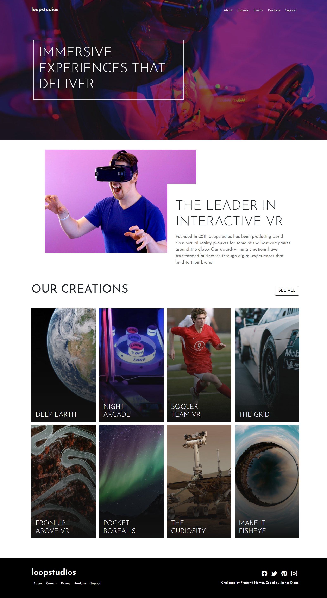
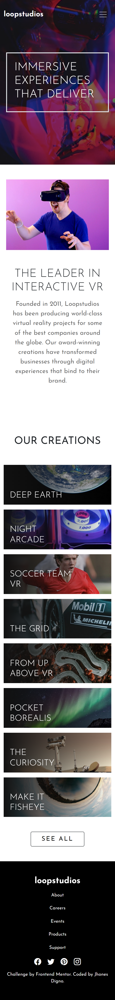

# Frontend Mentor - Loopstudios landing page solution

This is a solution to the [Loopstudios landing page challenge on Frontend Mentor](https://www.frontendmentor.io/challenges/loopstudios-landing-page-N88J5Onjw). Frontend Mentor challenges help you improve your coding skills by building realistic projects. 

### The challenge

Users should be able to:

- View the optimal layout for the site depending on their device's screen size
- See hover states for all interactive elements on the page

### Screenshot

It is my pleasure to share with you a screenshot of my solution to the loop-studios challenge. My primary goal in developing this solution was to create a visually stunning and engaging interface that showcases the high-quality work of the studio. The homepage features a clean and modern design, with clear navigation that allows users to easily access different sections of the site. Overall, I am proud of the solution I have developed and believe that it represents a significant improvement over traditional studio websites. I look forward to hearing your thoughts and feedback.

### Links

- Live Site URL: [Add live site URL here](https://loop-studios-tau-seven.vercel.app/)

### Built with

- Semantic HTML5 markup
- CSS custom properties
- SASS/SCSS
- [React](https://reactjs.org/) - JS library

## Author

- Website - [Jownsu](https://jownsu.github.io/)
- Frontend Mentor - [@jownsu](https://www.frontendmentor.io/profile/jownsu)
- Instagram - [jownsu](https://www.instagram.com/jownsu/)
- Linked In - [Jhones](https://www.linkedin.com/in/jhones-digno-866904213/)